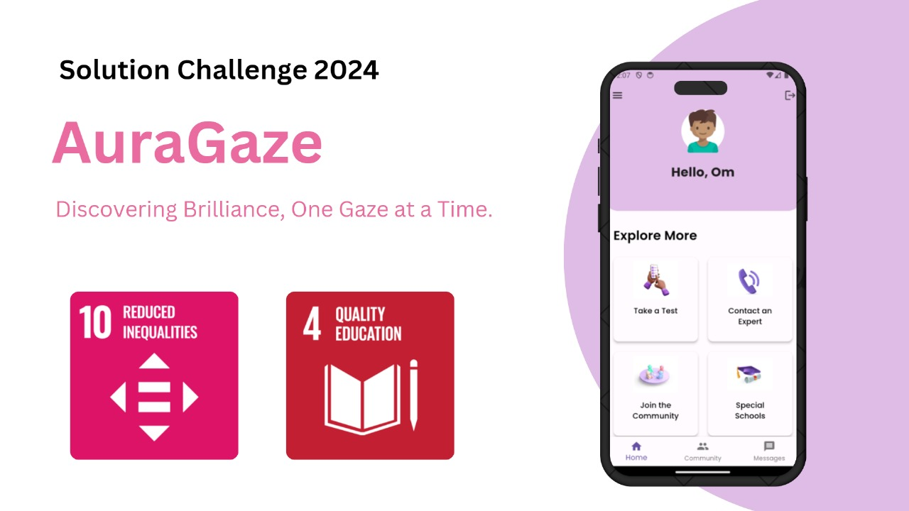
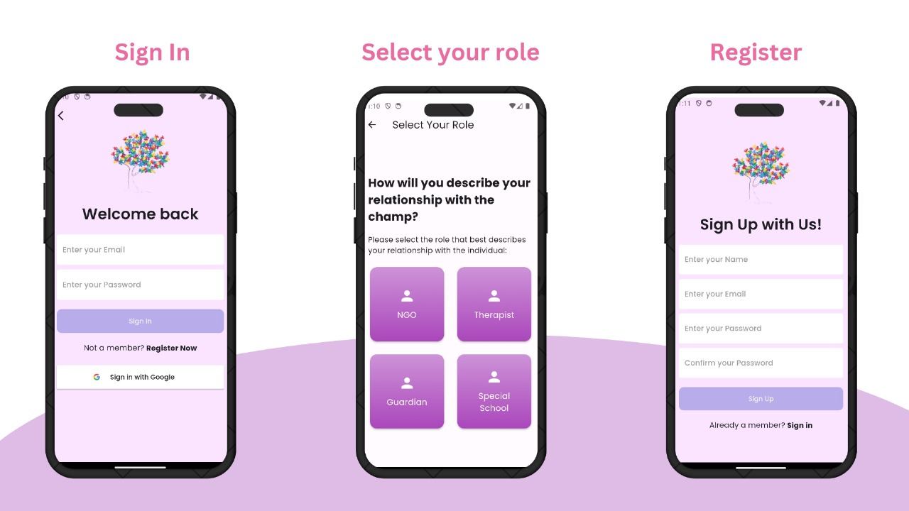
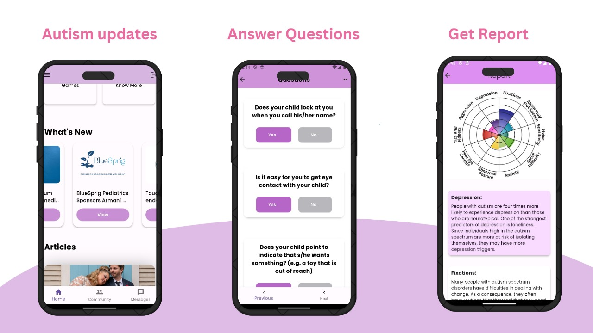
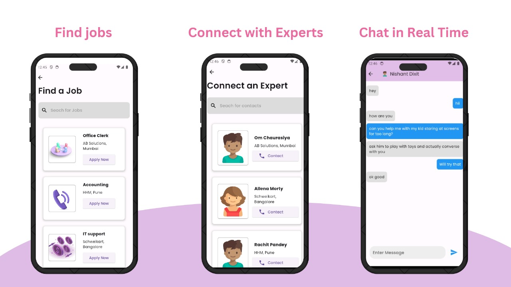

# Aura Gaze - Autism Support App

## Problem
Autism is a neurodevelopmental disorder that affects millions of people worldwide. According to the Centers for Disease Control and Prevention (CDC), approximately 1 in 54 children in the United States is diagnosed with autism spectrum disorder (ASD). Families and caregivers often face challenges in accessing resources, support, and personalized care for individuals with autism.

## Targeted UN SDGs

## What Our App Does
Our app, Aura Gaze, is designed to provide comprehensive support, resources, and community engagement for individuals with autism and their caregivers. It offers personalized assessments, access to professionals, and a supportive community to empower users in their autism journey.

## Video URL
[Watch the Demo Video](https://youtu.be/tiJtRs12OO0)

## Project Overview

The Autism Support app is a powerful platform developed using Flutter, a versatile cross-platform framework designed for building native applications. The app seamlessly integrates Firebase for backend services, ensuring scalability, real-time data synchronization, and robust user authentication.

  

  

### User Registration

Users can register with the app, choosing roles like Guardian, NGO, Special School, or Private Expert. Streamlined registration supports secure Google authentication.

### Dashboard Features

Upon registration, users access role-specific features:

### Guardian Features

- **Take a Test and Receive a Personalized Report:** Engage in an assessment for a customized autism understanding report.

- **Contact an Expert:** Connect with experts for real-time guidance.

- **Join Community and Chat:** Participate in a supportive community.

- **Discover Special Schools and NGOs:** Access a database for specialized services.

- **Job Opportunities:** Explore inclusive job listings.

- **Play Interactive Games:** Engage in games enhancing cognitive skills.

- **Learn More About Autism:** Access articles, videos, and resources.

### NGO / Special School / Experts Features

- **Alerts for Admission/Advice/Session Requests:** Receive timely alerts for support.

- **Record User Interactions:** Maintain organized interaction records.

- **Provide Feedback to the App:** Contribute to app improvement.

## Key Features
- Personalized assessments to understand individual needs and preferences
- Access to professionals including NGOs and private doctors for specialized care
- Interactive modules and games tailored to individual interests and abilities
- Community section for sharing experiences, asking questions, and offering support
- Real-time progress tracking and achievement monitoring

## How to Set Up
To set up the Autism Support app, follow these steps:
1. Clone the repository from [GitHub](https://github.com/nishaaannnt/solution-2024.git)
2. Navigate to the project directory
3. Run `flutter pub get` to install dependencies
4. Connect the app to Firebase by adding your Firebase project configuration
5. Run the app on your preferred device using `flutter run`

## About Us
Our decision to focus on autism support is driven by a dual purpose. Firstly, we observed a significant void in India for a dedicated community and app for individuals with autism. This motivated us to create a platform addressing this critical need. Additionally, a team member with a younger brother who is autistic provides a personal connection and deep motivation. Through our efforts, we aim to contribute to a more supportive and inclusive environment for individuals with autism and their families.

### Team Members
- [Nishant Dixit](https://github.com/nishaaannnt/solution-2024.git)
- [Om Bothre](https://github.com/ombothre)
- [Rachit Tandale](https://github.com/racchittt)
- [Shreeyash Kamble](https://github.com/Shreeyash1202)

Aura Gaze was developed by a team of passionate developers dedicated to making a positive impact in the autism community. We are committed to continuously improving and expanding our app to better serve individuals with autism and their caregivers.
